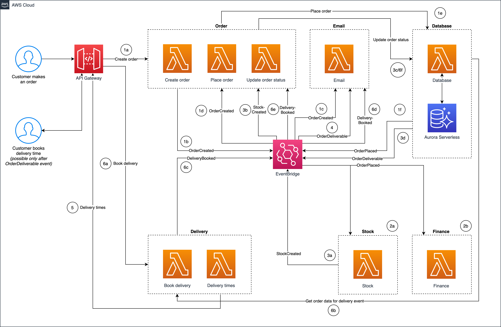
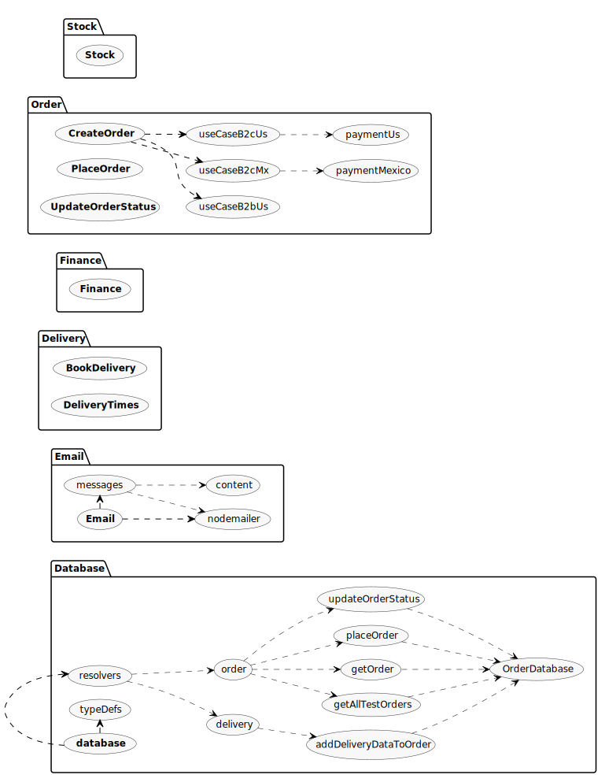
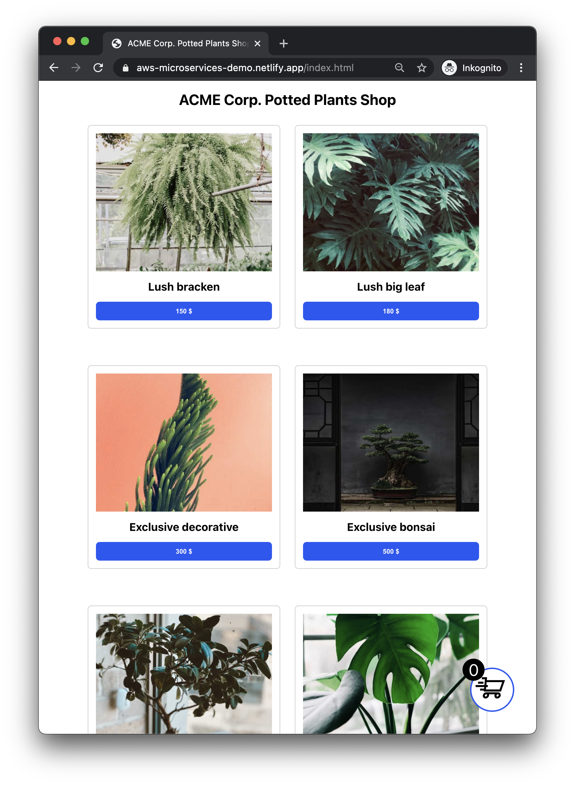
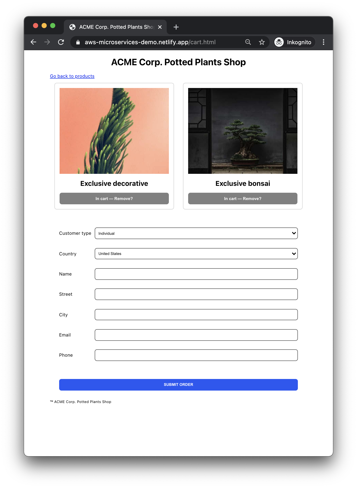

# ACME Corp. Potted Plants Web Shop: AWS microservices demo

Demonstration of a microservice architecture handling a commerce scenario. The approach here will take a few perhaps unconventional approaches, like using a shared database rather than going by the "one-database-per-microservice" orthodoxy.

Included in the repo is both a basic frontend application and the complete backend together with a Serverless Framework deployment configuration.

For better or worse, the scenario presented here will use a pretty standard backdrop of a commerce system. Why commerce? Well, for one, it's a shared concern for a lot of companies and is therefore easy to understand. Second, and more importantly, a commerce scenario should be easier to generalize than other domains, like finance or medtech.

**Note**: The code is not ready for production, since there are a number of cases you'd want to fix, like ensuring that an order cannot change its delivery time more than once.

Another part that is not fully explored in this demo is security, since all services run behind a single public API Gateway without any specific treatment for a production scenario.

## Technology stack

AWS services used:

- Lambda
- API Gateway
- S3 (for storing Lambda deployment code)
- Eventbridge
- Aurora Serverless

Source code uses the following technologies:

- Node
- Typescript
- Serverless Framework
- Webpack
- ESLint and Prettier

The source code is structured to conform with Clean Architecture, which resembles Domain Driven Design (DDD) so architects can have a better idea of how the actual code could be separated and structured in this type of scenario.

Note that the focus here is not on any ancillary aspects like CI, deployment, IAC or those types of concerns, but such parts should be sufficiently catered by the included Serverless Framework configuration.

## Scenario

A fictional business—ACME Corp.—has for many years been a popular, but kind of niche, brand that sells artisanal potted plants. Because of Covid-19 and so many having to work from home, their business suddenly skyrocketed in 2020. Everyone wanted to have something nice to look at in these dark times!

Unfortunately, the growing business meant that ACME Corp. has had problems. These range from technical problems, like orders falling through in the system and low visibility into order status, to certain organizational/operational issues, like that their domain modeling and source code is becoming a big ball of mud and that their small team of 4 developers are maxing out on how they can build new features when every day is mostly about fixing bugs in production. While their brand is still strong, customer satisfaction needs to be improved by giving better status updates on orders as well as ensuring all orders are valid and OK'ed through the system.

The tech stack was in the cloud before, but on virtual machines running on spaghetti code. Backend and frontend were on the same machine, no common interfaces were known and solid. Scaling and resiliency were never really handled and organized when the first development started back in 2013, and now is the time to start handling those "non-functional requirements" too!

## Key requirements

The most pressing requirements underpinning the business decision to spend time and money on replatforming and rebuilding were:

- **Business agility**: Create new features, introduce new flows, offers, customer types
- **Minimal operations**: Fully managed services to be used so the dev team can shift focus on value-adding work
- **Observability and real-time alerting**: Minimize time to uncover problems, and let the system inform about any operational issues
- **Reliability**: Systems need to be up and working without any significant downtime, nothing can fail/fall through undetected
- **Elasticity**: Sudden influx of customers should not mean any part of the system fails or becomes slow
- **Testability**: To support faster throughput and agile work, the overall flow must be testable (third parties must be mockable)

Implicit requirements include performance and security, but these are to be handled on a "by-the-book" or "hygiene" kind of level.

## Approach

ACME Corp. thusly decided to move (and rewrite) their three-tier monolith to a modern microservice architecture, leveraging fully managed cloud-native services. They also moved their existing database (MySQL) to Aurora Serverless.

### Domain

The overall domain concerns ACME Corp.'s commerce flow. Today there is one type of customer, **Individuals (B2C)**, but the C-level is pushing hard to support **Business customers (B2C)**. This is extremely important as strategic partnerships are already formed and solving this means ACME Corp. can grow substantially. The solution must therefore be flexible enough to cater for both these types. It is expected that in the future further segmentation will take place.

### Primary context

The primary context concerns the commerce processing pipeline, using both ACME Corp. services and their external dependencies, as well as a couple of auxiliary systems (like book-keeping and stock-keeping services) that need to be informed of critical updates in the commerce system. Each individual microservice is operated, run and built by similarly independent teams.

### Contracts

Strong contracts are enforced by:

- Using Typescript, a typed superset of Javascript. Intellisense and similar tooling makes it easy to work with
- Using GraphQL for APIs, which offers strongly-typed schemas. Schemas are dynamically discoverable making it easy to integrate with, and learn, a new API
- Using request validation on the public-facing part of API Gateway, enforcing valid usage of the order creation API
- Using Eventbridge (and its Schema Registry) to communicate event schemas, so events must follow set standards

## Application flow

### AWS

The AWS components are fairly few, but it's all orchestrated by events so the below may be a bit confusing at first. Don't worry, it's actually only five distinct events that make the show go on.



### Events

- `OrderCreated`: Order is created by the customer.
- `OrderPlaced`: Order is present in the order database.
- `StockCreated`: Third party has produced and delivered required inventory.
- `OrderDeliverable`: Order is final and ready to be delivered.
- `DeliveryBooked`: Customer has booked a delivery time for the order.

### Microservices

Services are split by context.

- `Stock`: Faked stock/inventory system integration, will request a stock refresh. In the demo this is immediately handled, but could be asynchronous (i.e. happen at any later point in time).
- `Finance`: Faked finance system integration.
- `Email`: Handles sending emails to customer based on various updates/events.
- `Database`: "Private" GraphQL server handling communication with an Aurora Serverless database. No clients/front-ends call this service directly.
- Order consists of `CreateOrder`, `PlaceOrder` and `UpdateOrderStatus`: Public services that interface from a business logic perspective with the Database service.
- Delivery consists of `BookDelivery` and `DeliveryTimes`: Public services that the front-end calls to handle the order's delivery info.

### Arkit

The Arkit diagram shows that most services are very basic and self-contained. The Database and Order services include a fair bit more of logic and use a Clean Architecture-style structure.



### Front-end web application

A basic web application written in vanilla JS, HTML and CSS. Divided into four pages:

- `index.html`: Main/products page.
- `cart.html`: Product cart and order page.
- `delivery.html`: Where the user selects a delivery time for their order.
- `success.html`: Redirection page for successful orders.



_Products page_



_Cart page_

## Notes

This project is organized as a monorepo: That's purely for convenience. In a real project you will mostly likely want to separate the microservices and create individual `serverless.yml` files and API Gateways for isolation.

When it comes to testability, you may wonder if it's really comparable using "fake" minimal services rather than mocking actual real services. Again, this is for illustration purposes. You would probably use regular test mocks or otherwise mock real services that you can't actually implement (like I'm doing here). Regardless, the idea is the same.

## Instructions

### 1. Create AWS RDS (Aurora Serverless) instance

Create a secret and Aurora instance as per [https://awsauroralabsmy.com/serverless/create/](https://awsauroralabsmy.com/serverless/create/).

### 2. Create the Orders table

In the RDS/Aurora panel, run the snippet in `infra/CreateOrdersTable.sql`.

### Optional: Create an Ethereal user for transactional emails

Create a user at [https://ethereal.email/create](https://ethereal.email/create) since an order will generate three different emails.

### 3. Add first configuration details

Put the Ethereal details in `serverless.yml` under `custom.nodemailer`. Also, place your AWS account ID under `custom.aws.awsAccountId`.

Ensure that any regions are correct.

### 4. Perform first deployment

Run `sls deploy` to deploy the stack with Serverless Framework. You'll want this first dummy deployment in order to create some resources you'll need to refer to shortly.

### 5. Update configuration with your API Gateway ID and Aurora details

Put your API Gateway ID in `serverless.yml` under `custom.aws.awsRandomDomain`. You can find this in AWS > API Gateway > [your API] > Stages > dev.

Put Aurora and EventBridge details under `custom.aws.database` and `custom.aws.arns`. Same as above, you'll find the required details in the respective views.

### 6. Re-deploy the stack

Run `sls deploy` to bring up an updated version that has all the right connections set up.

### Optional: Update front-end with your AWS information

If you want to use the front-end application, go to `src/app/js/app.js` and update the constants `AWS_ENDPOINT_ID` and `AWS_REGION` with your values. The "endpoint" bit is the same value as above ("API Gateway ID").

### Optional: Deploy front-end

I suggest you use a static hosting service like Netlify or Vercel to host the simple web application.

In `serverless.yml`, the `custom.appDeliveryPage` key refers to the URL which the second email will point to, where the user is expected to make their delivery time choice. So if your Netlify site is `my-aws-demo.netlify.app`, the value would be `https://my-aws-demo.netlify.app/delivery.html?order=`

## System test

It's possible to drive a complete system test by running `__tests__/system/index.js`. Please update `config.js` in that folder first.

## Example requests

### Order

#### Create order

```
POST https://{AWS_GATEWAY_ID}.execute-api.{AWS_REGION}.amazonaws.com/dev/createOrder

{
  "name": "Someone",
  "email": "asdf@something.xyz",
  "phone": "321321321",
  "street": "Thisway1",
  "city": "Thatplace",
  "customerType": "B2C",
  "market": "US",
  "products": "BB001,BL001",
  "totalPrice": 30000,
  "testId": 352,
  "orgNumber": 0
}
```

#### Place order

```
POST https://{AWS_GATEWAY_ID}.execute-api.{AWS_REGION}.amazonaws.com/dev/placeOrder

{
  "detail": {
    "name": "Someone",
    "email": "asdf@something.xyz",
    "phone": "123123123",
    "street": "Thisway1",
    "city": "Thatplace",
    "customerType": "B2C",
    "market": "MX",
    "products": "BB001,BL001",
    "totalPrice": 32500,
    "testId": 321321321,
    "orgNumber": 0
  }
}
```

### Database

#### Get all test orders (using a known test ID)

```
POST https://{AWS_GATEWAY_ID}.execute-api.{AWS_REGION}.amazonaws.com/dev/database

query {
  getAllTestOrders(testId: 797130) {
    orderId
    customerName
    customerEmail
    customerPhone
    customerStreet
    customerCity
    customerType
    customerMarket
    orderedProducts
    totalPrice
    deliveryTime
    status
    orgNumber
    testId
  }
}
```

#### Place order

```
POST https://{AWS_GATEWAY_ID}.execute-api.{AWS_REGION}.amazonaws.com/dev/database

mutation {
  placeOrder(name: "name", email: "email", phone: "phone", street: "street", city: "city", customerType: "B2C", market: "US", products: "BB001,BA002", totalPrice: 12300, orgNumber: 0, testId: 666) {
    orderId
  }
}
```

#### Update order status

```
POST https://{AWS_GATEWAY_ID}.execute-api.{AWS_REGION}.amazonaws.com/dev/database

mutation updateOrderStatus {
  updateOrderStatus(id: 9535446, status: DELIVERY_BOOKED) {
    orderId
  }
}
```

#### Get order

```
POST https://{AWS_GATEWAY_ID}.execute-api.{AWS_REGION}.amazonaws.com/dev/database

query {
  getOrder(id: 86757) {
    orderId
    customerName
    customerEmail
    customerPhone
    customerStreet
    customerCity
    customerType
    customerMarket
    orderedProducts
    totalPrice
    deliveryTime
    status
    testId
  }
}
```

#### Add delivery time to order

```
POST https://{AWS_GATEWAY_ID}.execute-api.{AWS_REGION}.amazonaws.com/dev/database

mutation {
  addDeliveryDataToOrder(deliveryData: {orderId: 86757,  deliveryTime: "16000000001"})
}
```

### Delivery

#### Book delivery

```
POST https://{AWS_GATEWAY_ID}.execute-api.{AWS_REGION}.amazonaws.com/dev/bookDelivery

{
  "orderId": 86757,
  "deliveryTime": "16000000000"
}
```

#### Delivery times

```
GET https://{AWS_GATEWAY_ID}.execute-api.{AWS_REGION}.amazonaws.com/dev/deliveryTimes
```

### Email

```
POST https://{AWS_GATEWAY_ID}.execute-api.{AWS_REGION}.amazonaws.com/dev/email

{
  "transaction": "DeliveryBooked",
  "orderId": 142124,
  "name": "Someone",
  "email": "asdf@something.net",
  "phone": "123123123123",
  "street": "ThatWay 1",
  "city": "ThereCity",
  "deliveryTime": "1200"
}
```

### Finance

```
POST https://{AWS_GATEWAY_ID}.execute-api.{AWS_REGION}.amazonaws.com/dev/finance

{
  "detail-type": "OrderCreated",
  "detail": {
    "orderId": 12345678,
    "totalPrice": 10000
  }
}
```

### Stock

```
POST https://{AWS_GATEWAY_ID}.execute-api.{AWS_REGION}.amazonaws.com/dev/stock

{
  "orderId": 12345678
}
```

## Credits

### Photographs

Credits go to the following photographers sharing their material on [Unsplash](https://unsplash.com/).

- [Photo](https://unsplash.com/photos/wNUK6R8HwGY) by [Narek Amiryan](https://unsplash.com/@narekamiryan)
- [Photo](https://unsplash.com/photos/FGCxKlkRYz8) by [Ainhoa Abad](https://unsplash.com/@ainhowits)
- [Photo](https://unsplash.com/photos/5sF6NrB1MEg) by [Caleb George](https://unsplash.com/@seemoris)
- [Photo](https://unsplash.com/photos/xTLXtIg2No0) by [Mike Marquez](https://unsplash.com/@mensroom)
- [Photo](https://unsplash.com/photos/KCnX0ux2jFo) by [zhao chen](https://unsplash.com/@zhaochen1975)
- [Photo](https://unsplash.com/photos/-ux_hZVPyWc) by [rebekah baines](https://unsplash.com/@rebekahbaines)

## Cart icon

The cart icon is from [Flaticon](https://www.flaticon.com/free-icon/shopping-cart-moving-symbol_57629).
